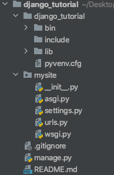

Django Study
============

1. 서버 셋팅

    1. python 설치. (나는 pyenv를 사용함)
    
    2. django 디렉토리 생성.
        ```commandline
        mkdir django_tutorial       
        ```
   
    3. python3 가상환경 생성 && 가상 환경 사용.
        ```commandline
        python3 -m env myvenv
        source myvenv/bin/activate
        ```
   
        >가상환경을 사용하는 이유???<br>
        >1. 자신이 원하는 환경을 셋팅했을때 다른 python 프로젝트에 영향을 주지 않기위해 독립적인 작업환경을 만드는 것이다.<br>예를들면 프로젝트 1에서는 A 라이브러리 1버전이 필요하고 프로젝트 2에서는 A 라이브러리 2버전이 필요한 경우, <br>A 라이브러리를 각각의 프로젝트에 따로 설치해서 필요버전(환경)이 서로 다른 프로젝트에 영향을 주지 않음.
        >2. 해당 프로젝트에 필요한 라이브러리들만 모아서 설치되 가능하기때문에 불필요 라이브러리가 같이 설치되는 등의 불필요한 라이브러리설치를 줄일 수 있음.
        >3. 라이브러리뿐 아니라 파이썬 버전 자체가 다른 경우도 있음. (python 2 OR 3)
    
    4. django 프로젝트 생성
        ```commandline
        django-admin startproject mysite .
        ```
    
    5. 생성된 프로젝트 directory 구조   
        >        
        >- manage.py : django에서 사용하는 스크립트. 사이트 관리를 도와주는 역할.
        >- settings.py : 웹사이트 설정을 모아놓은 파일.
        >- urls.py : 서버 url 구조가 있는 파일. (urlresolver???)

2. API 생성. (설문조사 기능 만들기)

    1. polls Directoy 생성.
       ```commandline
       python manage.py startapp polls
       ```
       
    2. polls/views.py에 view 작성하기. (아직은 view가 뭐하는 놈인지 모르는 상황)
        ```python
       from django.http import HttpResponse
       
       def index(request):
          return HttpResponse("Hello, world. You're at the polls index.")
        ```
     
    3. polls/urls.py파일 생성 & view를 호출하기 위해 URL과 연결하기.
        ```python
       from django.urls import path

       from . import views

       urlpatterns = [
          path('', views.index, name='index'),
       ]   
        ```
       
    4. mysite/urls.py 파일 수정.
        ```python
       from django.contrib import admin
       from django.urls import include, path

       urlpatterns = [
          path('polls/', include('polls.urls')),
          path('admin/', admin.site.urls),
       ]
        ```
        >* URLconf는 장고에서 URL과 일치하는 뷰를 찾기 위한 패턴들의 집합.
        >* mysite/urls.py가 최상위 URLconf.
        >* include를 이용해서 다른 URLconf(urls.py??)를 참조 할수 있도록 함.
        >* 다른 url 패턴이 생길때 마다 include를 이용해 패턴을 추가해야함. (admin.site.urls는 제외.)
        >* mysite.urls(가장 최초의 url 확인)에서 url 확인. => 일치하는 url이 확인되면 해당 URLconf에 요청을 넘김. => 동일한 패턴을 확인하게되면 해당 url과 연결되어있는 views를 실행.
 
 3. model 추가 (sqlite 사용)
 
    1. polls/models.py 에 모델 추가.
        * 모델은 부가적인 메타데이터를 가진 데이터베이스의 구조.
        * python의 DRY원칙에 따라 단 한곳에 단 한번 작성한다. 중복은 나쁜것이고 정규화는 좋은것이다.
        ```python
       from django.db import models

       class Question(models.Model):
           question_text = models.CharField(max_length=200)
           pub_date = models.DateTimeField('date published')     

       class Choice(models.Model):
           question = models.ForeignKey(Question, on_delete=models.CASCADE)
           choice_text = models.CharField(max_length=200)
           votes = models.IntegerField(default=0)
       ``` 
          
    2. django app에 polls app 추가.
       ```python
       INSTALLED_APPS = [
       'polls.apps.PollsConfig', # django에게 polls 앱을 사용한다고 알려줌.
       'django.contrib.admin',
       'django.contrib.auth',
       'django.contrib.contenttypes',
       'django.contrib.sessions',
       'django.contrib.messages',
       'django.contrib.staticfiles',
       ]
       ```
       
    3. DB에 모델을 위한 테이블 만들기.
        ```commandline
        python manage.py makemigrations polls
        python manage.py migrate
        ```
        > * 첫째 줄 명령어 : 모델의 추가 및 수정사항을 migration으로 저장하고 싶다고 django에 알려줌.(db에 반영할 수 있도록 migration 파일 생성.)
        > * 둘째 줄 명령어 : db에 모델 관련 table을 생성 및 model의 수정사항을 db schema와 동기화.
                                                                                                                                                
 4. 관리자 생성.
 
    1. 사용자 생성.
        ```commandline
        python manage.py createsuperuser
        ```                                                                                                                                            
        > 명령어 입력후 username, email, password 입력.
    
    2. 서버 실행후 localhost:8000/admin에 접속하여 로그인.
        ```commandline
        python manage.py runserver
        ```                                                                                                                                                                                                                                                                                                                                                                                                                                                                                                                                                                                                                                                                                    